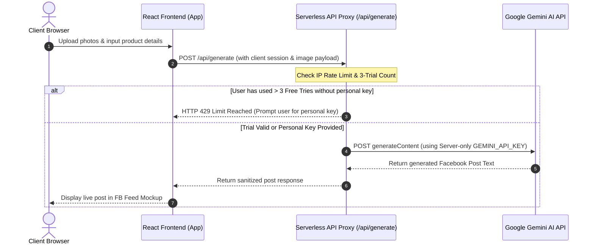

# Post Generator AI (Facebook Automation System) 🚀

An advanced, mobile-responsive **E-Commerce Facebook Business Page Post Automation Platform** built with **React 19, TypeScript, Vite, SweetAlert2, and Google Gemini Multimodal AI**.

Designed specifically for Bangladeshi E-Commerce businesses (e.g., `gadgetbro`) to generate high-converting, strategy-driven Facebook posts (Problem-Solving, Direct Hard-Sell, Storytelling, Specs Spotlight, Customer Trust) in seconds from raw product specs and multiple product photos!

---

## 🌟 Key Features

- **⚡ Modern Single-Input Workflow**:
  - Enter Page Name (Default: `gadgetbro`) + Optional Raw Product Specs + Optional Contact/Website Link.
- **📸 Multimodal AI Vision (Multiple Product Photos)**:
  - Upload multiple product photos. Gemini AI visually analyzes product colors, design, materials, and packaging to generate tailored Facebook post copies.
- **🎯 Strategy-Driven Copywriting (Zero Emojis & Clean Line Breaks)**:
  - 5 proven marketing frameworks: *Direct Offer*, *PAS Problem-Solving*, *Storytelling & Lifestyle*, *Feature & Spec Spotlight*, and *Customer Review/Trust*.
  - Clean, ready-to-copy Bengali, Banglish, English, or **Bangla & English Mix** text.
- **📏 Flexible Post Length & Count Selector**:
  - Select 1 to 5 post variations per generation (Default: 1 Post).
  - Select post length: *Short & Punchy (4-5 lines)*, *Balanced Mix*, or *Detailed & In-Depth*.
- **🔒 Serverless API Proxy & Security (100% Protected API Keys)**:
  - System Gemini API key is proxy-shielded on the server side (`/api/generate`) so it **NEVER reaches client browser DevTools**.
  - Strict **3-Free Trial Limit** per user/IP. After 3 free tries, users enter their own free Gemini API key in Config for unlimited generations.
- **📱 Realistic Facebook Feed Mockup & Direct FB Publishing**:
  - 1-Click copy with SweetAlert toast alert.
  - Direct 1-Click Facebook Page publishing via Meta Graph API.
- **💾 Full LocalStorage Persistence**:
  - Saved posts, store prefilled contact details, custom API keys, and trial usage counts automatically persist in `localStorage`.

---

## 🏗️ Architecture & Serverless API Proxy Flow

To protect your personal Gemini API Key from being inspected via browser DevTools (F12) and to strictly enforce the **3-Free Trial Limit**, the system uses a **Serverless API Proxy Architecture**:



---

## 🚀 How to Implement Serverless API Proxy Deployment (Step-by-step)

### Step 1: Vercel Serverless Function (`api/generate.ts`)
Create a file at `api/generate.ts` in the root of your Vercel project:

```typescript
// api/generate.ts (Vercel Serverless Proxy Endpoint)
import type { VercelRequest, VercelResponse } from '@vercel/node';

export default async function handler(req: VercelRequest, res: VercelResponse) {
  if (req.method !== 'POST') {
    return res.status(405).json({ error: 'Method not allowed' });
  }

  const { contents, generationConfig, userApiKey, trialCount } = req.body;

  // 1. Resolve API Key: User key first, Server ENV key fallback
  const apiKey = userApiKey?.trim() || process.env.GEMINI_API_KEY;

  if (!apiKey) {
    return res.status(400).json({ error: 'No Gemini API Key configured.' });
  }

  // 2. Server-side Rate Limiting (If using fallback key and trial > 3)
  if (!userApiKey && trialCount >= 3) {
    return res.status(429).json({
      error: 'Free trial limit reached (3/3). Please enter your own free Gemini API Key in Config for unlimited generations.'
    });
  }

  try {
    const response = await fetch(
      `https://generativelanguage.googleapis.com/v1beta/models/gemini-3.6-flash:generateContent?key=${apiKey}`,
      {
        method: 'POST',
        headers: { 'Content-Type': 'application/json' },
        body: JSON.stringify({ contents, generationConfig }),
      }
    );

    const data = await response.json();
    return res.status(response.status).json(data);
  } catch (error: any) {
    return res.status(500).json({ error: error.message || 'Internal proxy server error' });
  }
}
```

### Step 2: Configure Environment Variable on Vercel
1. Push project to GitHub.
2. Go to **Vercel Dashboard -> Project Settings -> Environment Variables**.
3. Add Key: `GEMINI_API_KEY` = `your_secret_gemini_api_key`.
4. Deploy! Your API key is now 100% server-side secured.

---

## 🛠️ Local Development & Setup

```bash
# 1. Clone repository
git clone https://github.com/emranhossen-dev/automation.git
cd automation

# 2. Install dependencies
npm install

# 3. Create .env.local fallback key for local dev
echo "VITE_GEMINI_API_KEY=your_gemini_api_key_here" > .env.local

# 4. Start Vite development server
npm run dev
```

Open browser at `http://localhost:5174/` to test locally!

---

## ⚙️ Tech Stack

- **Frontend**: React 19, TypeScript, Vite, Lucide React, SweetAlert2.
- **Styling**: Custom Glassmorphism & Flat Dark Minimalist CSS.
- **AI Model**: Google Gemini (`gemini-3.6-flash` Multimodal API).
- **Publishing API**: Meta Graph API (`POST /{page-id}/feed`).
- **Deployment**: Vercel Serverless API Proxy.
